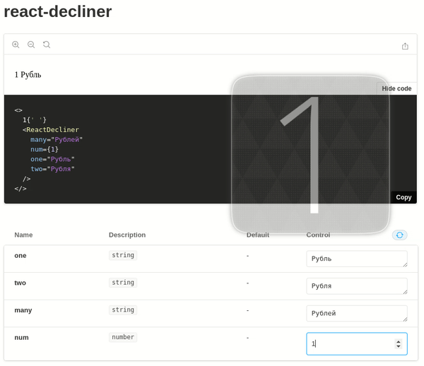

## ReactDecliner

### Usage

```tsx
import React from 'react'
import ReactDecliner from 'react-decliner'

export const MyComponent = () => {
  return <ReactDecliner num={1} many="Рублей" one="Рубль" two="Рубля" />
}
```


